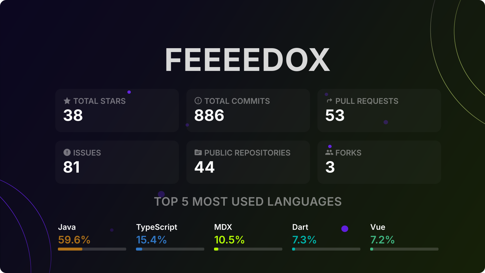

# Hi, I'm Florian! 

**Software Engineer | Linux User | Handsome young man (~ My Grandma)**

🔭 I am currently working on a few private and public projects. 
🚀 I build *(attempt to build)* digital solutions with a focus on clean code, modern architecture, and automation.

## ⚡ Get in Touch
Do you have a project in mind or just want to connect? 
It's best to use my **[contact form at fedox.ovh](https://fedox.ovh/contact)** – that's how I can respond most quickly.

## 💻 My Skills

### 🚀 Frameworks & Languages

### ⚙️ Databases

### 🛠️ Tools & Systems

## 🌟 My *public* GitHub Stats

   

## ⚡ Hall of Fame

> Wanna stick here forever?  
> Just [**»»» click here to submit yourself «««**](https://github.com/feeeedox/feeeedox/issues/new?title=Submit%20yourself&body=Just%20press%20%27Create%27.%20You%20don%27t%20need%20to%20do%20anything%20else.%0AWhen%20this%20issue%20is%20closed%20by%20the%20bot,%20the%20README%20will%20be%20updated.) 💫

<!--START_SECTION:users-->
| Name | Pic. | Date |
| ---- | ---------------- | ---- |
| [HabsGleich](https://github.com/HabsGleich) |  | 2026-06-07 |
| [DeoSCRIPTS](https://github.com/DeoSCRIPTS) |  | 2026-05-02 |
| [miraxmiraxmirax](https://github.com/miraxmiraxmirax) |  | 2026-03-11 |
<!--END_SECTION:users-->

📜 Past Legends

<!--START_SECTION:old_users-->
| Name | Pic. | Date |
| ---- | ---------------- | ---- |
| [jonasxyz1337](https://github.com/jonasxyz1337) |  | 2026-03-11 |
| [caraqos](https://github.com/caraqos) |  | 2026-02-23 |
| [maximjsx](https://github.com/maximjsx) |  | 2026-02-15 |
| [C45702](https://github.com/C45702) |  | 2025-11-10 |
| [Castorkaaa](https://github.com/Castorkaaa) |  | 2025-11-10 |
| [Austria7](https://github.com/Austria7) |  | 2025-11-02 |
| [S42yt](https://github.com/S42yt) |  | 2025-09-26 |
| [AboutCloudMC](https://github.com/AboutCloudMC) |  | 2025-08-29 |
| [Ente3](https://github.com/Ente3) |  | 2025-08-26 |
| [BlackDevCoding](https://github.com/BlackDevCoding) |  | 2025-08-24 |
| [byRoadrunner](https://github.com/byRoadrunner) |  | 2025-08-13 |
| [Teekqu](https://github.com/Teekqu) |  | 2025-08-05 |
| [creepzcodes](https://github.com/creepzcodes) |  | 2025-08-05 |
| [m1337xx](https://github.com/m1337xx) |  | 2025-08-05 |
| [Grafjojo](https://github.com/Grafjojo) |  | 2025-08-05 |
| [Gabimolia](https://github.com/Gabimolia) |  | 2025-08-05 |
| [NameGeandert](https://github.com/NameGeandert) |  | 2025-08-05 |
| [Niedlichkeit](https://github.com/Niedlichkeit) |  | 2025-08-05 |
| [Bozcx](https://github.com/Bozcx) |  | 2025-08-05 |
| [Winkarst-cpu](https://github.com/Winkarst-cpu) |  | 2025-08-05 |

<!--END_SECTION:old_users-->

